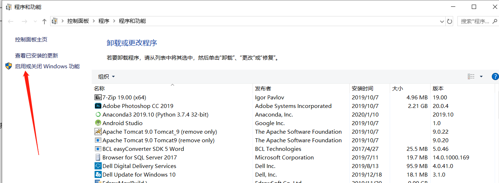
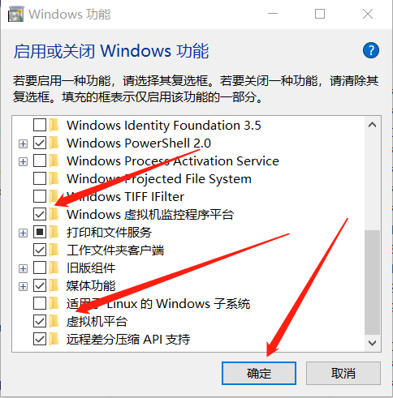

# windows10安装linux虚拟机过程和出现的问题

- 安装过程参考链接

​    [虚拟机安装及使用linux，看这一篇就够了](http://www.macrozheng.com/#/reference/linux_install)

- 问题描述

使用[VirtualBox](https://so.csdn.net/so/search?q=VirtualBox)启动虚拟机时，弹出如下报错：

```
Call to WHvSetupPartition failed: ERROR_SUCCESS (Last=0xc000000d/87) (VERR_NEM_VM_CREATE_FAILED).
返回 代码: E_FAIL (0x80004005)
组件: ConsoleWrap
界面: IConsole {872da645-4a9b-1727-bee2-5585105b9eed}
```

- 解决步骤
1. 打开控制面板，在路径上输入：`控制面板\程序\程序和功能`,然后点击”启用或关闭 Windows 功能“。



2. 找到如图两个复选框，并勾选上，点击确定即可启用。    



2. 在VirtualBox的安装路径下进入cmd命令窗口，输入以下命令：

```bash
#指定vbox下的虚拟系统开启这个功能
VBoxManage setextradata "<虚拟机名字>" "VBoxInternal/NEM/UseRing0Runloop" 0

#或指定vbox所有虚拟系统开启
VBoxManage setextradata global "VBoxInternal/NEM/UseRing0Runloop" 0
```

4. 开启后 就可以体验Hyper-v与Vbox双开的快乐了。但VM暂时还没有和Hyper-v共存的方法
- 解决步骤参考链接

​    [VirtualBox启动虚拟机，报错：Call to WHvSetupPartition failed](https://blog.csdn.net/Jop_qq/article/details/104043422)

​    [【杂项】Virtualbox 6与Hyper-V共存](https://rehtt.com/index.php/archives/225/)

- [virtualbox虚拟机安装centos的时候安装上去了，但是重启之后却要重新安装](https://blog.csdn.net/xiaoyucjl/article/details/121370534)