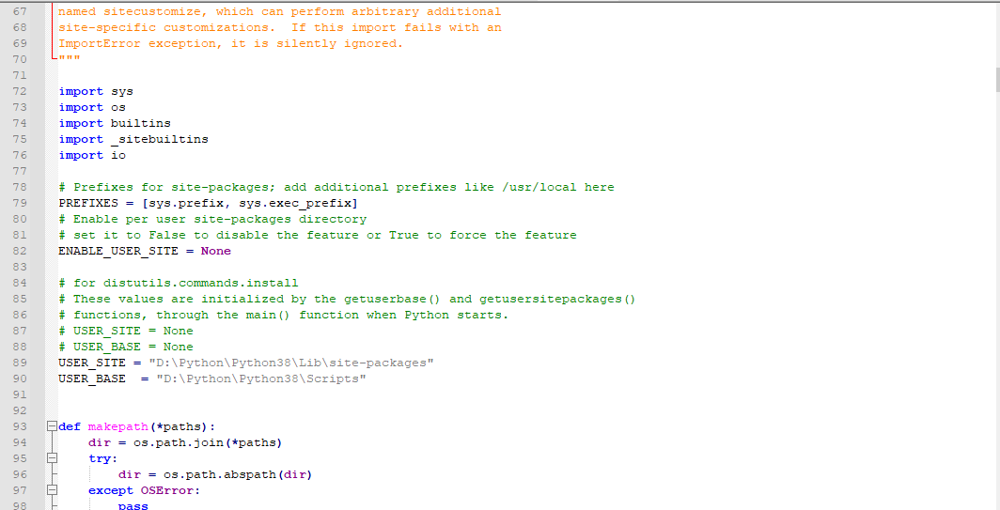

# python修改pip install安装路径

1. 查看默认安装路径

```shell
python -m site
```

2. 查看对应配置文件

```
python -m site -help
```

3. 修改配置文件

	- 找到上图的`site.py`配置文件，修改`USER_SITE`和`USER_BASE`
	
	

### 参考链接

- [pip install 默认安装路径修改](https://www.cnblogs.com/maggieq8324/p/12099068.html)
