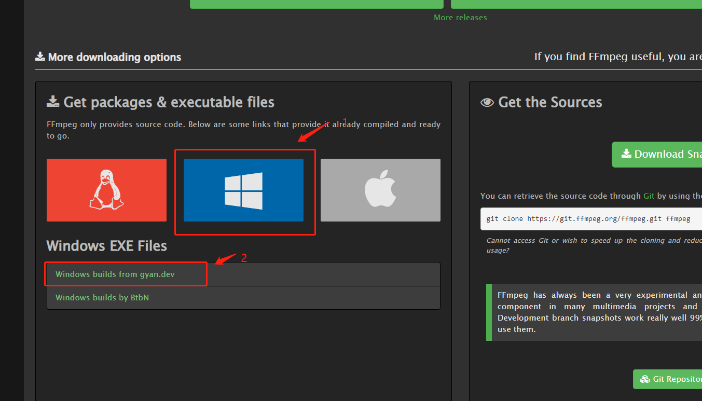
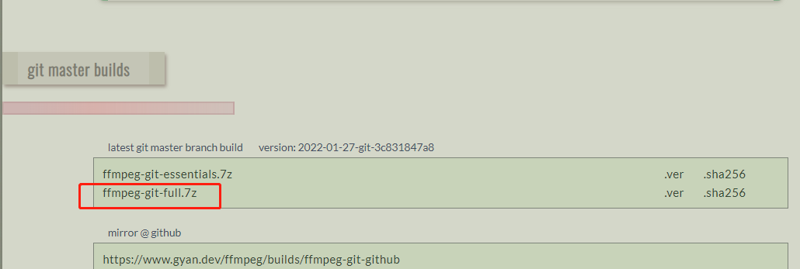
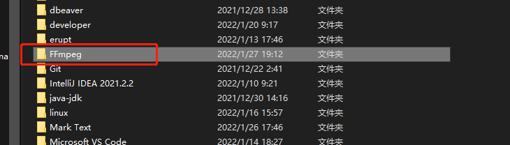
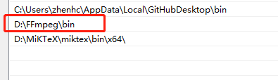

### FFmpeg安装

1. 下载链接：https://ffmpeg.org/download.html



2. 点击下载ffmpeg-git-full.7z



3. 解压之后重命名为FFmpeg



4. 设置环境变量到bin目录下。



5. 验证是否安装成功

```shell
ffmpeg --version
```


### 常见用法

1. 查看文件信息

```shell
$ ffmpeg -i input.mp4 -hide_banner
```

2. 提取音频

```shell
$ ffmpeg \
-i input.mp4 \
-vn -c:a copy \
output.aac
```

3. 截图

下面的例子是从指定时间开始，连续对1秒钟的视频进行截图。

```bash
$ ffmpeg \
-y \
-i input.mp4 \
-ss 00:01:24 -t 00:00:01 \
output_%3d.jpg
```

如果只需要截一张图，可以指定只截取一帧。

```bash
$ ffmpeg \
-ss 01:23:45 \
-i input \
-vframes 1 -q:v 2 \
output.jpg
```

上面例子中，`-vframes 1`指定只截取一帧，`-q:v 2`表示输出的图片质量，一般是1到5之间（1 为质量最高）。