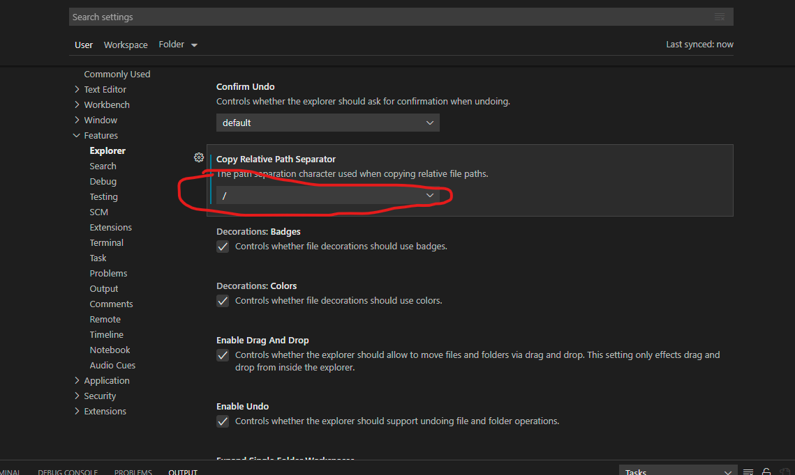

## 工作区间（workspace）:同时打开多个项目

```shell
{
	"folders": [
		{
			"path": "..\\IDE\\idea-projects\\vue-element-admin"
		},
		{
			"path": "..\\IDE\\idea-projects\\python\\learn-python3-master"
		},
		{
			"path": "..\\IDE\\idea-projects\\python\\Python"
		}
	],
	"settings": {}
}
```
## 复制相对路径时，斜杠设置为/
settings->Features->Explorer中的`Copy Relative Path Separator`设置为/。


## 修改vscode的插件安装路径
1. 打开cmd命令窗口，输入`code --help`,查看命令提示。
2. 输入命令(路径最后加一个'\')
```
code --extensions-dir F:\vscode\extensions\
```
3. 重新安装插件，或者复制以前的插件到新路径即可