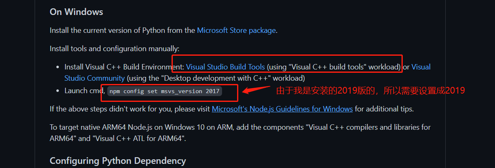

## 安装Visual Studio生成工具2019
> 起因：当学习开源项目[javascript-algorithms](https://github.com/trekhleb/javascript-algorithms)的时候，npm install下载失败

根据报错信息，访问链接：https://github.com/nodejs/node-gyp#on-windows，如图：

安装时，直接勾选工作负荷的 使用C++的桌面开发组件就行，其他默认就行。（以为所需空间比较大，中间可以修改一下安装路径，大概十几分钟就能安装成功），如图：

安装完成后，发现还是报错，所以接着访问：[Microsoft's Node.js Guidelines for Windows](https://github.com/Microsoft/nodejs-guidelines/blob/master/windows-environment.md#compiling-native-addon-modules)，如图：

最后，npm install下载依赖成功。
